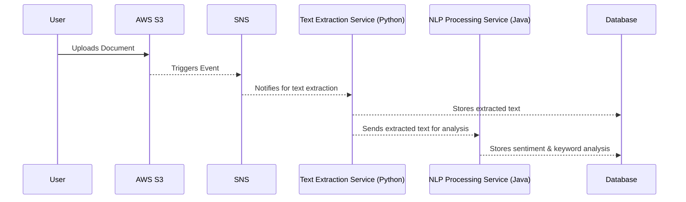

# 📄 Event-Driven Document Processing System

An **event-driven microservices-based** system that automates document processing using **Python (FastAPI/Django)** and **Java (Spring Boot)**. The system is designed to run **on AWS (S3, SNS, SQS, DynamoDB)** and **locally using Docker**.

---

## 🌟 Features
- 📤 **Uploads documents to AWS S3** (PDF, Word, Text)
- 🔔 **Triggers SNS event** upon upload
- 🐍 **Python Service (FastAPI/Django)** extracts text from documents
- ☕ **Java Service (Spring Boot)** analyzes sentiment and keywords
- 🗄 **Stores results in DynamoDB/PostgreSQL**
- 🛠 **Deployable via Docker & AWS**

---

## 🏗 Architecture Overview



---

## 🛠 Tech Stack

| Component          | Technology                     |
|-------------------|--------------------------------|
| **Frontend (Optional)** | React (for UI if needed)  |
| **Python Service** | FastAPI / Django REST        |
| **Java Service**   | Spring Boot                   |
| **Event Broker**   | AWS SNS + SQS                 |
| **Storage**        | AWS S3, DynamoDB/PostgreSQL   |
| **Containerization** | Docker                      |
| **Deployment**    | AWS ECS Fargate / Lambda      |

---

## 🚀 Getting Started

1️⃣ Clone the Repository
```
git clone https://github.com/yourusername/event-driven-docs.git
cd event-driven-docs
```

2️⃣ Run Locally with Docker
```
docker-compose up --build
```

3️⃣ Deploy to AWS
	•	Set up AWS S3, SNS, SQS, and DynamoDB
	•	Configure IAM roles & policies
	•	Deploy microservices using ECS Fargate
